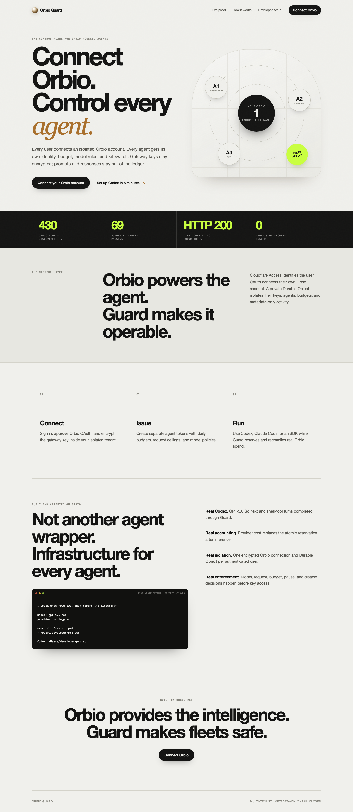
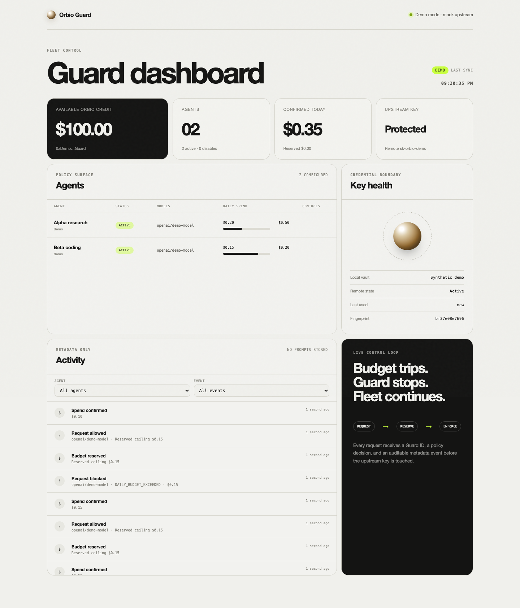
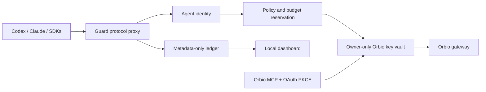

# Orbio Guard

**One wallet. Many agents. Safe spend.**

Orbio Guard is a local-first credit-control plane for teams running multiple AI agents
on one Orbio account. Agents receive separate Guard identities and policies while the
real Orbio gateway key stays inside an owner-only local vault.

Public Cloudflare demo: <https://orbio-guard.pages.dev>. The full Worker deployment uses
Access-protected `guard.larkvine.org` and token-authenticated `api.guard.larkvine.org`.



## Why Guard

Orbio gives an agent a key that spends the account's live inference balance. Guard adds
the fleet controls needed when that balance is shared across repositories, tools, or
teammates:

- Per-agent daily budgets and per-request ceilings.
- Exact or wildcard model allow-lists.
- Pause and disable kill switches.
- Separate high-entropy Guard credentials instead of a shared upstream key.
- Atomic spend reservations that prevent concurrent budget races.
- Safe MCP-backed key creation, rotation, and revocation workflows.
- Metadata-only activity records with no prompts or model responses.
- Responsive local dashboard for wallet, key, agent, budget, and incident visibility.



## Two-Minute Demo

Run the deterministic demo without spending Orbio credit:

```bash
npm install
npm run dev -- demo --hold
```

The demo creates two temporary agents:

1. Alpha completes a request.
2. Beta completes a request.
3. Beta attempts to exceed its daily budget and receives
   `429 DAILY_BUDGET_EXCEEDED` before the upstream key is touched.
4. Alpha continues successfully, proving one policy trip does not stop the fleet.

Open the printed dashboard URL to see spend and decisions update. Demo mode is visibly
labeled and uses synthetic account/key data.

Silent screen-capture draft: [Orbio Guard demo MP4](docs/assets/orbio-guard-demo.mp4).
Synthetic narrated draft:
[Orbio Guard narrated demo MP4](docs/assets/orbio-guard-demo-narrated.mp4).
See `docs/video-storyboard.md` for narration and editing cues.

Submission-length drafts:

- [Narrated product pitch](docs/assets/orbio-guard-pitch-draft.mp4) - 77.6 seconds.
- [Narrated technical walkthrough](docs/assets/orbio-guard-technical-draft.mp4) -
  1 minute 43.6 seconds.

## Supported Clients

Guard exposes one local base URL with a shared policy path for:

- OpenAI Chat Completions: `POST /v1/chat/completions`.
- OpenAI Responses API: `POST /v1/responses`.
- Anthropic Messages: `POST /v1/messages`.
- Buffered JSON and SSE streaming responses.

Generate policy-validated client configuration:

```bash
npm run dev -- setup codex --agent <agent-id> --model <model-id>
npm run dev -- setup claude --agent <agent-id> --model <model-id>
npm run dev -- setup cursor --agent <agent-id> --model <model-id>
```

Codex uses a user-level Responses provider. Claude Code uses Anthropic gateway
environment variables. Cursor remains guided/manual when its installed build exposes a
custom OpenAI base URL.

## Quick Start

Requirements: Node.js 22 or newer and an Orbio account for live MCP/key operations.

```bash
npm install
npm run dev -- doctor
npm run dev -- auth
npm run dev -- key create --label "Orbio Guard"
npm run dev -- agent add \
  --name "Coding agent" \
  --project "my-project" \
  --daily-budget 5 \
  --max-request 0.50 \
  --models "openai/*,anthropic/*"
npm run dev -- serve
```

Save the one-time `og_agent_...` token printed by `agent add`. The upstream
`sk-orbio-...` key is stored by Guard and is never given to the agent.

Local endpoints:

- Landing page: `http://127.0.0.1:4318/`.
- Dashboard: `http://127.0.0.1:4318/dashboard`.
- OpenAI-compatible base: `http://127.0.0.1:4318/v1`.
- Health: `/healthz`.
- Key-aware readiness: `/readyz`.

## Architecture



The proxy performs identity, model, status, request-limit, and daily-budget checks before
loading the upstream key. Successful responses confirm provider-reported cost; unpriced
errors release reservations. Stale reservations are conservatively confirmed after a
crash by default.

See `docs/architecture.md` for the complete component and request sequence diagrams.

## Security Model

- Native execution binds to loopback by default.
- OAuth and upstream-key files use owner-only permissions.
- Guard agent tokens are shown once; only SHA-256 hashes are persisted.
- State writes use a cross-process lock, schema validation, temporary file, and atomic
  rename.
- Dashboard APIs mask wallet identifiers and omit credentials.
- Key creation keeps an owner-only recovery response until vault storage succeeds.
- Docker runs as an unprivileged user and Compose publishes ports to host loopback only.

Read `SECURITY.md` before using Guard outside a local development environment.

## Operator Commands

```text
orbio-guard doctor
orbio-guard auth [--no-open]
orbio-guard status
orbio-guard key import|create|status|clear|revoke|migrate-legacy
orbio-guard agent add|list|pause|resume|disable|rotate-token
orbio-guard policy show|set
orbio-guard budget recover
orbio-guard activity
orbio-guard setup codex|claude|cursor
orbio-guard serve
orbio-guard demo [--hold]
```

## Verification

```bash
npm run release:check
docker build -t orbio-guard:release .
```

The release gate currently includes:

- Strict TypeScript checking.
- 61 unit and integration tests.
- Desktop and mobile Chromium rendering checks.
- Production build and dependency audit.
- Mock Chat Completions, Responses, Anthropic Messages, and SSE streaming checks.
- Cross-process state locking and crash-recovery tests.

The same release gate and Docker build pass in GitHub Actions.

## Documentation

- `docs/architecture.md` - components, trust boundaries, and request sequence.
- `docs/agent-policies.md` - identities, model rules, and budgets.
- `docs/agent-setup.md` - Codex, Claude Code, and Cursor configuration.
- `docs/key-lifecycle.md` - create, rotate, revoke, and recovery behavior.
- `docs/proxy.md` - protocols, accounting, errors, and limitations.
- `docs/dashboard.md` - views, privacy, refresh, and visual verification.
- `docs/activity-ledger.md` - recorded and intentionally excluded data.
- `docs/demo.md` - repeatable demo and narration.
- `docs/deployment.md` - native and container operation.
- `docs/cloudflare.md` - public Pages deployment and security boundary.
- `docs/troubleshooting.md` - common auth, key, policy, budget, and container issues.
- `docs/pitch-script.md` - timed product pitch.
- `docs/technical-walkthrough.md` - timed engineering walkthrough.
- `docs/video-storyboard.md` - reproducible MP4 recording and narration cues.
- `docs/submission.md` - final Build Week checklist.

## Verified Status and Limitations

- Live Orbio OAuth, authenticated tool discovery, balance/status reads, and key creation
  are verified.
- The runtime tool contract currently differs from Orbio's public MCP page; Guard detects
  contract changes and keeps sanitized fixtures.
- Live key rotation is verified. Guard replaced the stale vault copy, exposed only the
  new fingerprint, and retained owner-only permissions.
- A limited live `openai/gpt-4o-mini` request completed through Guard with HTTP 200 and
  confirmed provider-reported spend. The temporary agent was disabled immediately.
- Live key revoke remains intentionally unexecuted.
- The repository remains private by operator request and must be made public deliberately
  before a public Build Week submission.
- The supplied deployment is localhost-oriented, not a public multi-tenant service.

Current release candidate: `v0.1.0-rc.4`, prepared September 7, 2026.
