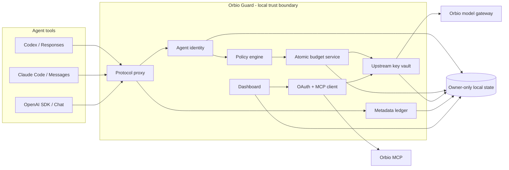
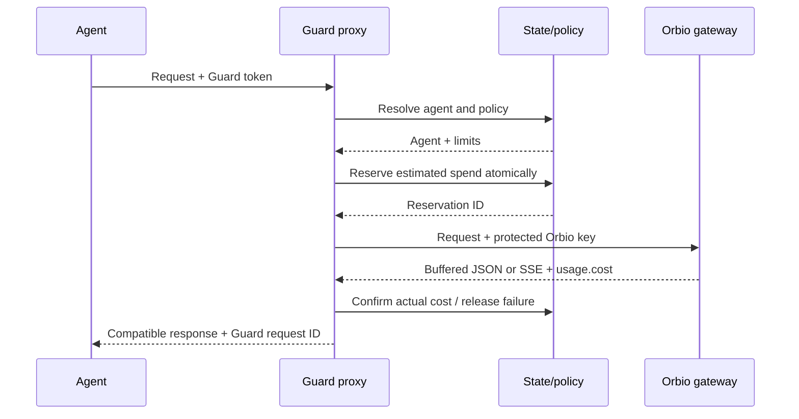

# Architecture and trust boundaries

Updated: 2026-09-06

## System overview

## Trust boundaries

### Untrusted agent clients

Agents may be buggy, compromised, or incorrectly configured. They receive a high-entropy
Guard token that identifies one policy record. They never receive OAuth tokens or the
account-level Orbio gateway key.

### Guard process

The local Guard process is trusted to:

- Authenticate agent tokens.
- Enforce model, status, request, and daily-budget policy.
- Load the upstream key only after authorization succeeds.
- Reconcile provider usage and write metadata events.
- Serve the local dashboard without returning secrets.

### Orbio services

Orbio MCP is trusted for account authentication, balance, key status, and key lifecycle.
The Orbio gateway is trusted for model routing and usage reporting. Guard treats network
errors and missing usage conservatively.

### Local filesystem

OAuth, upstream-key, agent, budget, and ledger files use owner-only permissions. State
updates use an inter-process lock, temporary file, atomic rename, and schema validation.

## Request sequence

## Failure behavior

- Unknown or invalid identity: fail before reading the upstream key.
- Paused/disabled agent: `403` before upstream access.
- Request or daily limit: `429` before upstream access.
- Upstream unpriced error: release reservation and record metadata.
- Successful response without cost: confirm the conservative reservation.
- Process crash with in-flight reservation: recover after TTL; default policy confirms
  the reservation because the provider may have processed it.
- Missing OAuth during dashboard refresh: report remote status unavailable without
  launching an interactive browser.
