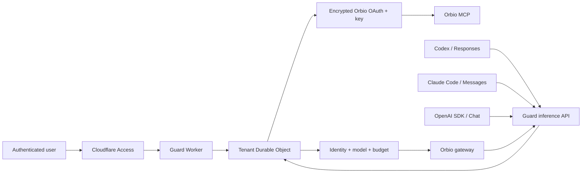
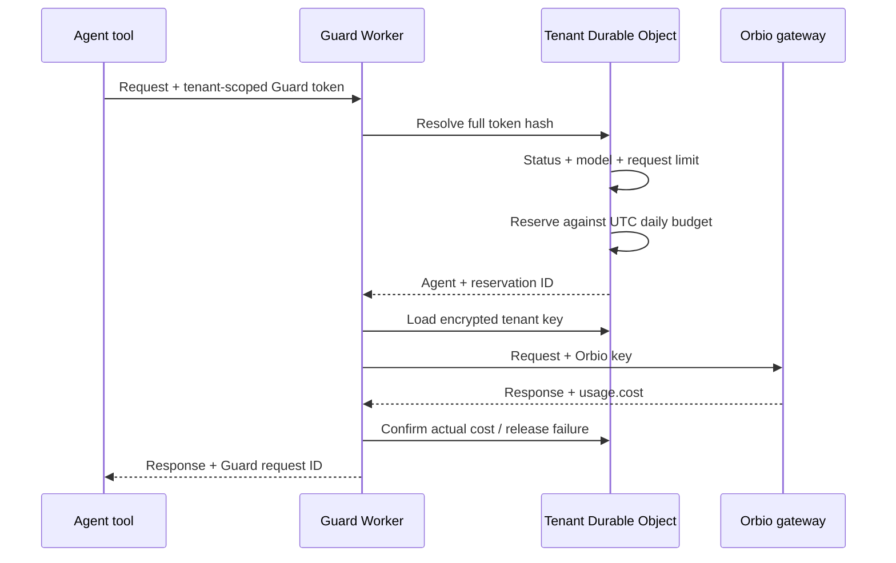
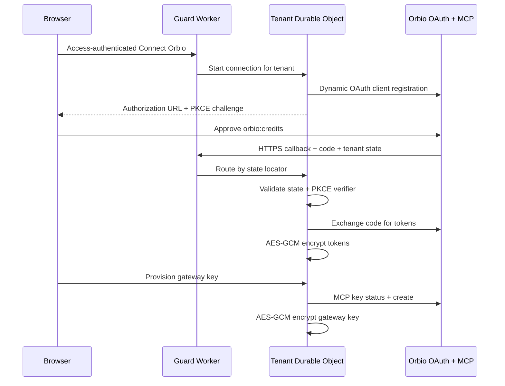

# Architecture and trust boundaries

Updated: 2026-09-07

## Cloud system overview

Every verified Access email maps through keyed HMAC to one private SQLite-backed Durable
Object. The locator is not a raw email hash. OAuth tokens and gateway keys are encrypted
with AES-256-GCM before storage.

New agent tokens carry the non-secret tenant locator plus a random secret. Routing uses
the locator; authorization hashes and compares the complete token. Legacy unscoped tokens
continue routing to the original `primary` tenant.

## Cloud request sequence

## Orbio connection sequence

## Trust boundaries

### Untrusted agents

Agents receive only one Guard token. They never receive Orbio OAuth credentials or the
tenant gateway key. Invalid, paused, disabled, disallowed, or over-budget requests stop
before key decryption.

### Access-authenticated operators

Cloudflare Access validates login before the operator application. The Worker independently
validates JWT signature, issuer, audience, and email. Browser mutations also require the
exact operator origin.

### Tenant Durable Object

Each object serializes its own agents, budgets, reservations, encrypted connection, and
metadata ledger. One tenant cannot read or spend another tenant's key or state.

### Public OAuth callback

`auth.guard.larkvine.org` exposes only the exact callback path. The tenant object requires
an exact stored state and PKCE verifier before token exchange.

### Orbio

Orbio OAuth and MCP are authoritative for account authorization, balance, key status, and
key lifecycle. The gateway is authoritative for model routing and provider-reported cost.

## Failure behavior

- Missing Access identity: redirect before operator UI access.
- Direct Worker bypass: `403 ACCESS_REQUIRED`.
- Unknown agent token: `401` before credential access.
- Paused, disabled, or disallowed agent: `403` before credential access.
- Request or daily limit: `429` before credential access.
- Unconnected tenant: `503 ORBIO_NOT_CONNECTED`.
- Existing Orbio key: stop and require explicit destructive replacement confirmation.
- Interrupted request: conservatively confirm stale reservation after TTL.

## Local runtime

The Node CLI remains available for localhost and container operation with owner-only
files and cross-process locking. Cloud production uses Access, Worker secrets, AES-GCM
tenant encryption, and Durable Objects instead.
